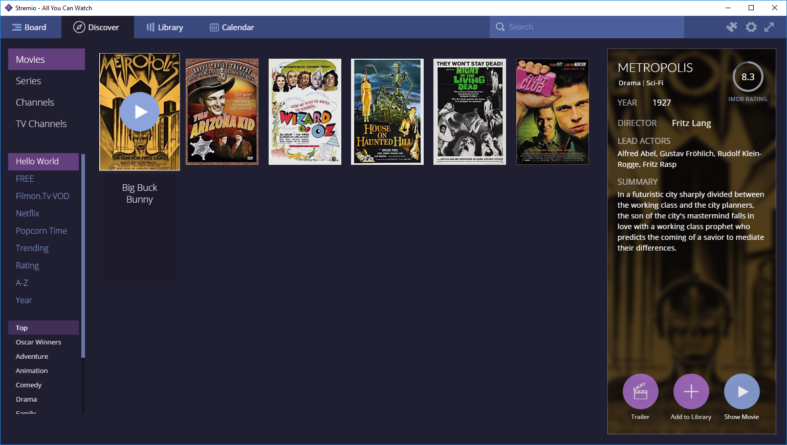
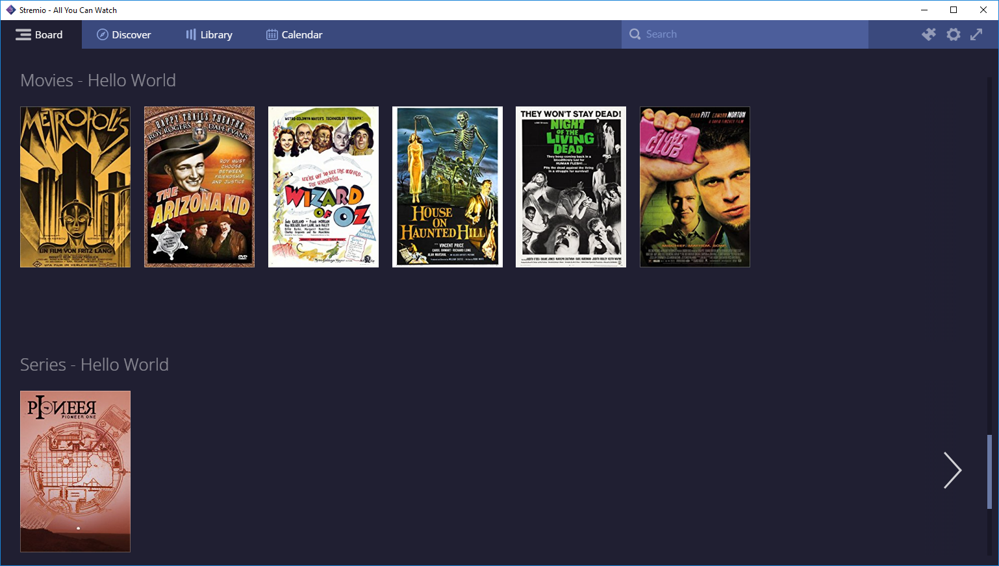

# Hello world add-on for Stremio

### Adds a few public domain movies to Stremio

This example shows how to make a Stremio Add-on with Stremio's [Add-on SDK](https://github.com/Stremio/stremio-addon-sdk).

Alternatively, you can also see how to make a Stremio Add-on with the [Express](https://www.npmjs.com/package/express) NPM module at [Stremio Express Add-on Hello World](https://github.com/Stremio/addon-helloworld-express), or explore our [many other examples](https://github.com/Stremio/stremio-addon-sdk/tree/master/docs/examples).


## Quick Start

```bash
npm install
npm start
```

Then run Stremio, click the add-on button (puzzle piece icon) on the top right, and write `http://127.0.0.1:7000/manifest.json` in the "Addon Url" field on the top left.


## Basic tutorial on how to re-create this add-on step by step

Step 1: init a npm project
=========================

**Pre-requisites: Node.js, Git**

This is the first, boilerplate step of creating an add-on for Stremio. Create a node.js project and add the [stremio-addons](http://github.com/Stremio/stremio-addons) module as dependency.

```bash
mkdir stremio-hello-world
cd stremio-hello-world
npm init
npm install --save stremio-addon-sdk@1.0.x
git add *
git commit -a -m "initial commit"
```

**NOTE:** to test this add-on, you need to complete Step 6. Start the add-on with `node server.js` and add the add-on to stremio by going to the *Addons* page (top right icon) and typing `http://127.0.0.1:7000/manifest.json` in the text field in the top left and pressing enter.

Step 2: Create addon.js, fill manifest
===========================

In this step, we define the add-on name, description and purpose.

Create an `addon.js` file:
```javascript
const { addonBuilder } = require("stremio-addon-sdk");

const manifest = {
    "id": "org.stremio.helloworld",
    "version": "1.0.0",

    "name": "Hello World Addon",
    "description": "Sample addon providing a few public domain movies",

    //"icon": "URL to 256x256 monochrome png icon", 
    //"background": "URL to 1024x786 png/jpg background",

    // set what type of resources we will return
    "resources": [
        "catalog",
        "stream"
    ],

    "types": ["movie", "series"], // your add-on will be preferred for these content types

    // set catalogs, we'll have 2 catalogs in this case, 1 for movies and 1 for series
    "catalogs": [
        {
            type: 'movie',
            id: 'helloworldmovies'
        },
        {
            type: 'series',
            id: 'helloworldseries'
        }
    ],

    // prefix of item IDs (ie: "tt0032138")
    "idPrefixes": [ "tt" ]

};
```

Step 3: init an add-on server
============================

Add to your addon.js:
```javascript
const builder = new addonBuilder(manifest);
```

Step 4: basic streaming
==============================

To implement basic streaming, we will set-up a dummy dataset with a few public domain movies. 

```javascript
const dataset = {
    // Some examples of streams we can serve back to Stremio ; see https://github.com/Stremio/stremio-addon-sdk/blob/master/docs/api/responses/stream.md
    "tt0051744": { name: "House on Haunted Hill", type: "movie", infoHash: "9f86563ce2ed86bbfedd5d3e9f4e55aedd660960" }, // torrent
    "tt1254207": { name: "Big Buck Bunny", type: "movie", url: "http://clips.vorwaerts-gmbh.de/big_buck_bunny.mp4" }, // HTTP stream
    "tt0031051": { name: "The Arizone Kid", type: "movie", ytId: "m3BKVSpP80s" }, // YouTube stream
    "tt0137523": { name: "Fight Club", type: "movie", externalUrl: "https://www.netflix.com/watch/26004747" }, // redirects to Netflix
    "tt1748166:1:1": { name: "Pioneer One", type: "series", infoHash: "07a9de9750158471c3302e4e95edb1107f980fa6" }, // torrent for season 1, episode 1
};
```

And then implement ``defineStreamHandler`` as follows:

```javascript
// Streams handler
builder.defineStreamHandler(function(args) {
    if (dataset[args.id]) {
        return Promise.resolve({ streams: [dataset[args.id]] });
    } else {
        return Promise.resolve({ streams: [] });
    }
})
```

**As you can see, this is an add-on that allows Stremio to stream 4 public domain movies and 1 series episode - in very few lines of code.**

Depending on your source, you can implement streaming (`defineStreamHandler`) or catalogs (`defineCatalogHandler`) of ``movie``, ``series``, ``channel`` or ``tv`` content types.

To load that add-on in the desktop Stremio, click the add-on button (puzzle piece icon) on the top right, and write `http://127.0.0.1:7000/manifest.json` in the "Addon Repository Url" field on the top left.

Step 5: implement catalog
==============================

We have 2 methods serving meta: 

- ``defineCatalogHandler`` serves basic metadata (id, type, name, poster) and handles loading of both the catalog feed and searching;

- ``defineMetaHandler`` serves [advanced metadata](https://github.com/Stremio/stremio-addon-sdk/blob/docs/docs/api/responses/meta.md) for individual items, for imdb ids though (what we're using in this example add-on), we do not need to handle this method at all as it is handled automatically by Stremio's Cinemeta

**For now, we have the simple goal of loading the movies we provide on the top of Discover.**

Append to addon.js:

```javascript
const METAHUB_URL = "https://images.metahub.space"

const generateMetaPreview = function(value, key) {
    // To provide basic meta for our movies for the catalog
    // we'll fetch the poster from Stremio's MetaHub
    // see https://github.com/Stremio/stremio-addon-sdk/blob/master/docs/api/responses/meta.md#meta-preview-object
    const imdbId = key.split(":")[0]
    return {
        id: imdbId,
        type: value.type,
        name: value.name,
        poster: METAHUB_URL+"/poster/medium/"+imdbId+"/img",
    }
}

builder.defineCatalogHandler(function(args, cb) {
    // filter the dataset object and only take the requested type
    const metas = Object.entries(dataset)
        .filter(([_, value]) => value.type === args.type)
        .map(([key, value]) => generateMetaPreview(value, key))

    return Promise.resolve({ metas: metas })
})
```

Step 6: putting everything together
===================

It's time to run our add-on!

Append to addon.js:
```javascript
module.exports = builder.getInterface()
```

And now create a new file, server.js, that only contains:

```javascript
const { serveHTTP } = require("stremio-addon-sdk");

const addonInterface = require("./addon");
serveHTTP(addonInterface, { port: 7000 });
```

Run the add-on with `npm start` and add `http://127.0.0.1:7000/manifest.json` as the Repository URL in Stremio.

This add-on also supports serverless deployment, just create a new file called serverless.js, that contains:

```javascript
const { getRouter } = require("stremio-addon-sdk");
const addonInterface = require("./addon");

const router = getRouter(addonInterface);

module.exports = function(req, res) {
    router(req, res, function() {
        res.statusCode = 404;
        res.end();
    });
}
```

You can check out [this now.json file](./now.json) that would make this add-on work with now.sh serverless deployment.

Now, if you want to deploy your add-on and make it accessible publically, proceed to [our deployment guide](https://github.com/Stremio/stremio-addon-sdk/blob/master/docs/deploying.md).


Step 7: result
===================





