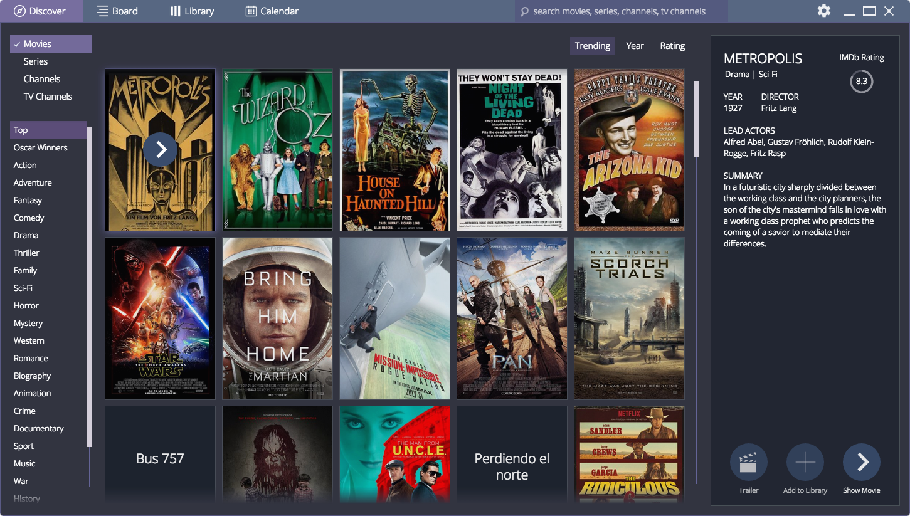

# Hello world add-on for Stremio
### Adds a few public domain movies to Stremio
## Basic tutorial on how to re-create this add-on step by step

Step 1: init a npm project
=========================

**Pre-requisites: Node.js, Git**

This is the first, boilerplate step of creating an add-on for Stremio. Create a node.js project and add the [stremio-addons](http://github.com/Stremio/stremio-addons) module as dependency.

```bash
mkdir stremio-hello-world
cd stremio-hello-world
npm init
npm install stremio-addons --save
git add *
git commit -a -m "initial commit"
```

Step 2: Create index.js, fill manifest
===========================

In this step, we define the add-on name, description and purpose.

Create an index.js file:
```javascript
var Stremio = require("stremio-addons");

var manifest = { 
    "name": "Example Addon",
    "description": "Sample addon providing a few public domain movies",
    "icon": "URL to 256x256 monochrome png icon", 
    "background": "URL to 1366x756 png background",
    "id": "org.stremio.helloworld",
    "version": "1.0.0",
    "types": ["movie"],

    // filter: when the client calls all add-ons, the order will depend on how many of those conditions are matched in the call arguments for every add-on
    "filter": { "query.imdb_id": { "$exists": true }, "query.type": { "$in":["series","movie"] } }
};
```

Step 3: init an add-on server
============================

Add to the end of your index.js:
```javascript
var methods = { };
var addon = new Stremio.Server(methods, { stremioget: true }, manifest);
```

This creates an Add-on server object with our manifest and no methods. We can later define methods using the ``methods`` object we created.

Append again:
```javascript
var server = require("http").createServer(function (req, res) {
    addon.middleware(req, res, function() { res.end() }); // wire the middleware - also compatible with connect / express
}).on("listening", function()
{
    console.log("Sample Stremio Addon listening on "+server.address().port);
}).listen(process.env.PORT || 7000);
```

**This initializes a server for the add-on on port 7000. This is the server Stremio clients should connect to to use the add-on.**

_Optional:_ Alternatively, if you're making an integration for a website / web app written in Node.js, you can embed the add-on in your server code by chaining it to the list of your connect/express middlewares with ``app.use(addon.middleware)``.

Step 4: basic streaming
==============================

To implement basic streaming, we will set-up a dummy dataset with a few public domain movies. 

And then implement ``stream.find`` as follows:

```javascript
/* Methods
 */
methods["stream.find"] = function(args, callback) {
    if (! args.query) return callback();
    callback(null, [dataset[args.query.imdb_id]]);
}
```

**As you can see, this is an add-on that allows Stremio to stream 6 public domain movies - in about 40 lines of code.**

Depending on your source, you can implement streaming (stream.find) or catalogues (meta.find, meta.get) of ``movie``, ``series``, ``channel`` or ``tv`` content types.

To load that add-on in the desktop Stremio, start it with ``. --service=http://localhost:7000/stremioget/stremio/v1`` command line.

Step 5: implement metadata (Discover catalogue)
==============================

We have 3 methods serving meta: ``meta.find`` handles loading the catalogue and metadata, ``meta.get`` which loads metadata for individual items, and ``meta.search`` which performs a full text search.

**For now, we have the simple goal of loading the movies we provide on the top of Discover.**

Append to index.js:
```javascript
// To allow us to set a custom order in Discover, we have to set a LID property
manifest.stremio_LID = "helloWorld";

// Prefer this add-on for queries with sort.popularities.helloWorld property (directed to our LID)
manifest.filter["sort.popularities.helloWorld"] = { $exists: true };

// To provide meta for our movies, we'll just proxy the official cinemeta add-on
var client = new Stremio.Client();
client.add("http://cinemeta.strem.io/stremioget");

methods["meta.find"] = function(args, callback) {
    // Proxy Cinemeta, but get only our movies
    args.query.imdb_id = args.query.imdb_id || { $in: Object.keys(dataset) };
    client.meta.find(args, function(err, res) {
        callback(err, res ? res.map(function(r) { r.popularities = { helloWorld: 10000 }; return r }) : null);
    });
}
```


Step 6: result
===================




**And in the [open-source client](https://github.com/Stremio/stremio-addons-client/)**


