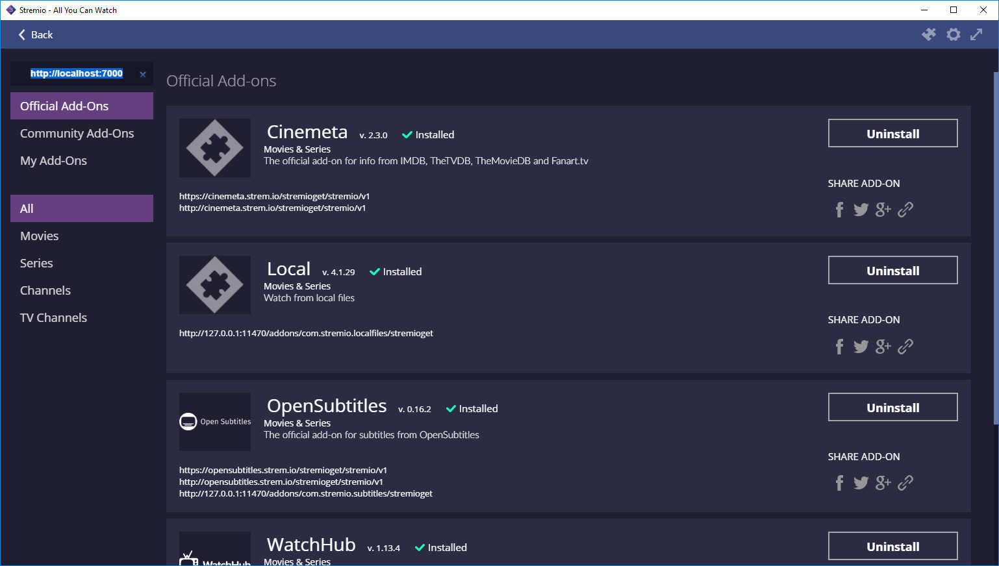

# Hello world add-on for Stremio
### Adds a few public domain movies to Stremio


## Quick Start

```bash
npm install
npm start
```

Then run Stremio, click the add-on button (puzzle piece icon) on the top right, and write `http://127.0.0.1:7000` in the "Addon Repository Url" field on the top left.


## Basic tutorial on how to re-create this add-on step by step

Step 1: init a npm project
=========================

**Pre-requisites: Node.js, Git**

This is the first, boilerplate step of creating an add-on for Stremio. Create a node.js project and add the [stremio-addons](http://github.com/Stremio/stremio-addons) module as dependency.

```bash
mkdir stremio-hello-world
cd stremio-hello-world
npm init
npm install stremio-addons --save
git add *
git commit -a -m "initial commit"
```

**NOTE:** to test this add-on, you need to complete Step 3 (init an add-on server). Start the add-on with `node index.js` and add the add-on to stremio by going to the *Addons* page (top right icon) and typing `http://localhost:7000` in the text field in the top left and pressing enter. 

Step 2: Create index.js, fill manifest
===========================

In this step, we define the add-on name, description and purpose.

Create an `index.js` file:
```javascript
var addonSDK = require("stremio-addon-sdk");

process.env.STREMIO_LOGGING = true; // enable server logging for development purposes

var manifest = {
    "id": "org.stremio.helloworld",
    "version": "1.0.0",

    "name": "Hello World Addon",
    "description": "Sample addon providing a few public domain movies",

    "icon": "URL to 256x256 monochrome png icon", 
    "background": "URL to 1366x756 png background",

    // set what type of resources we will return
    "resources": [
        "catalog",
        "stream"
    ],

    "types": ["movie", "series"], // your add-on will be preferred for these content types

    // set catalogs, we'll have 2 catalogs in this case, 1 for movies and 1 for series
    "catalogs": [
        {
            type: 'movie',
            id: 'helloworldmovies'
        },
        {
            type: 'series',
            id: 'helloworldseries'
        }
    ]

    // prefix of item IDs (ie: "tt0032138")
    "idPrefixes": [ "tt" ]

};
```

Step 3: init an add-on server
============================

Add to the end of your index.js:
```javascript
var addon = new addonSDK(manifest);
```

Step 4: basic streaming
==============================

To implement basic streaming, we will set-up a dummy dataset with a few public domain movies. 

```javascript
var dataset = {
    // Some examples of streams we can serve back to Stremio ; see https://github.com/Stremio/stremio-addon-sdk/blob/master/docs/api/responses/stream.md
    "tt0051744": { name: "House on Haunted Hill", infoHash: "9f86563ce2ed86bbfedd5d3e9f4e55aedd660960" }, // torrent
    "tt1254207": { name: "Big Buck Bunny", url: "http://clips.vorwaerts-gmbh.de/big_buck_bunny.mp4", availability: 1 }, // HTTP stream
    "tt0031051": { name: "The Arizone Kid", yt_id: "m3BKVSpP80s", availability: 3 }, // YouTube stream
    "tt0137523": { name: "Fight Club", externalUrl: "https://www.netflix.com/watch/26004747" }, // redirects to Netflix
    "tt1748166:1:1": { name: "Pioneer One", infoHash: "07a9de9750158471c3302e4e95edb1107f980fa6" }, // torrent for season 1, episode 1
};
```

And then implement ``defineStreamHandler`` as follows:

```javascript
addon.defineStreamHandler(function(args, cb) {

    if (! args.id)
        return cb(null, { streams: [] })

    if (dataset[args.id]) {
        // remove "name" attribute of streams response
        // "name" can be used to customize the name of the stream
        // but in this case, we just want the addon name to show
        var streams = [dataset[args.id]].map(function(x) { delete x.name; return x })
        cb(null, { streams: streams });
    } else
        cb(null, null)

})
```

**As you can see, this is an add-on that allows Stremio to stream 4 public domain movies and 1 series episode - in very few lines of code.**

Depending on your source, you can implement streaming (`defineStreamHandler`) or catalogs (`defineCatalogHandler`) of ``movie``, ``series``, ``channel`` or ``tv`` content types.

To load that add-on in the desktop Stremio, click the add-on button (puzzle piece icon) on the top right, and write `http://127.0.0.1:7000` in the "Addon Repository Url" field on the top left.

Step 5: implement catalog
==============================

We have 2 methods serving meta: 

- ``defineCatalogHandler`` serves basic metadata (id, type, name, poster) and handles loading of both the catalog feed and searching;

- ``defineMetaHandler`` serves [advanced metadata](https://github.com/Stremio/stremio-addon-sdk/blob/docs/docs/api/responses/meta.md) for individual items, for imdb ids though (what we're using in this example add-on), we do not need to handle this method at all as it is handled automatically by Stremio's Cinemeta

**For now, we have the simple goal of loading the movies we provide on the top of Discover.**

Append to index.js:

```javascript
// determine media type by index
var typeFromId = function(index) {
    // object keys that include ":" are series, for example:
    // "tt1748166:1:1" refers to season 1, episode 1 of the "tt1748166" imdb id
    return index.includes(':') ? 'series' : 'movie'
}

var METAHUB_URL = 'https://images.metahub.space'

var basicMeta = function(data, index) {
    // To provide basic meta for our movies for the catalog
    // we'll fetch the poster from Stremio's MetaHub
    var imdbId = index.split(':')[0]
    return {
        id: imdbId,
        type: typeFromId(index),
        name: data.name,
        poster: METAHUB_URL+'/poster/medium/'+imdbId+'/img',
    }
}

addon.defineCatalogHandler(function(args, cb) {

    var metas = []

    // iterate dataset object and only add movies or series
    // depending on the requested type
    for (var key in dataset) {
        if (args.type == typeFromId(key)) {
            metas.push(basicMeta(dataset[key], key))
        }
    }

    cb(null, { metas: metas })

})
```

Step 6: run addon
===================

It's time to run our add-on!

Append to index.js:
```javascript
addon.runHTTPWithOptions({ port: 7000 })
```

Step 7: result
===================




**And in the [open-source client](https://github.com/Stremio/stremio-client-demo/)**


